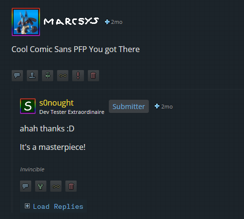
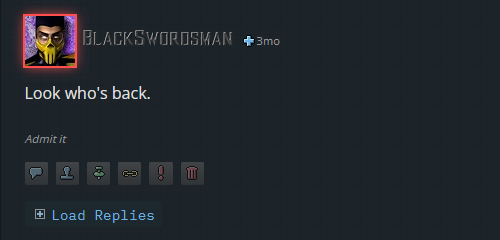

# gb-load-replies.user.js

Automatically click all Level 1+ 'Load Replies' buttons when they intersect the device's viewport.

## Credits

Original idea by YellowJello ([Discord post](https://discord.com/channels/143910467977347072/457220527795470348/1108566864319229992))

## Screenshots

Level 1 Button - **WILL BE** automatically clicked on.

Level 0 Button - will **NOT** be automatically clicked on.

